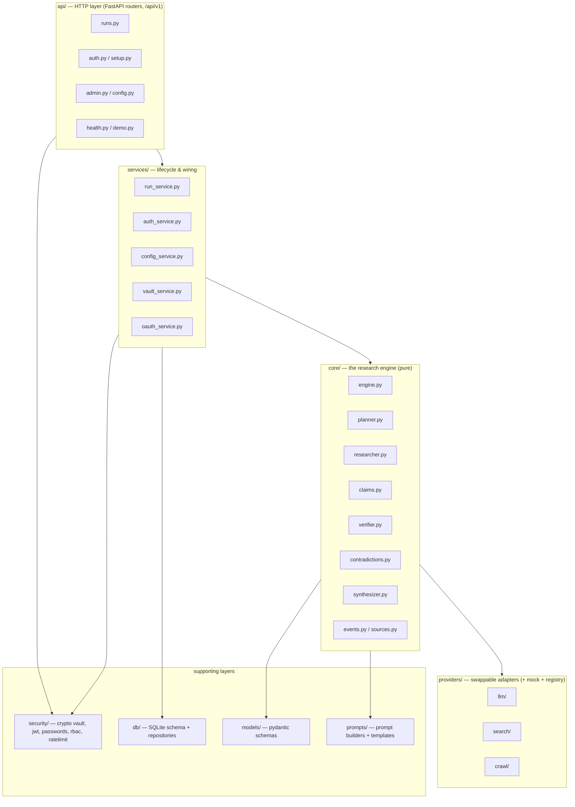
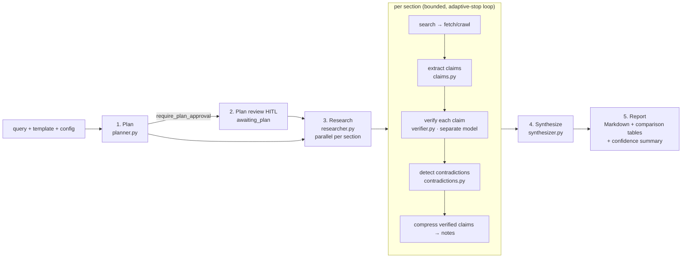
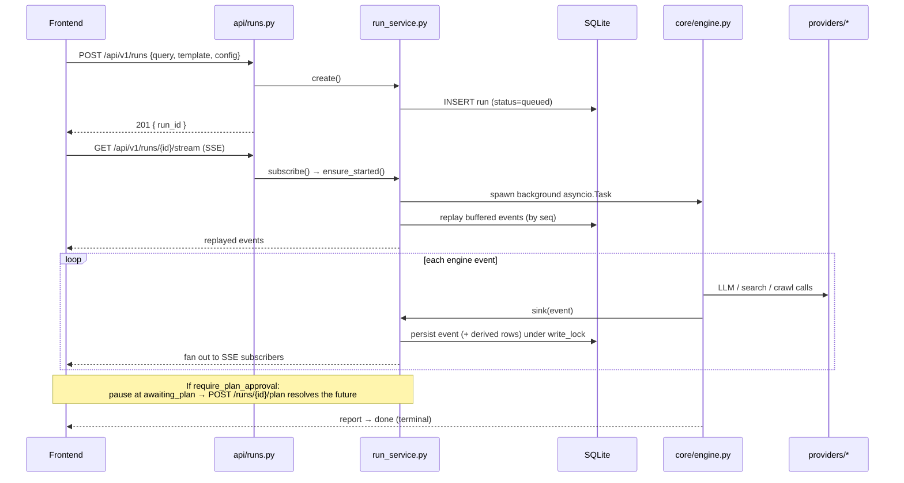

# Architecture

How **AI DeepResearch AutoFlow** is put together: the research engine loop, the
backend layering, the request/data flow, security at a glance, and the extension
points for adding your own providers.

For the exact wire shapes (REST bodies, SSE events, report structure) the
authoritative source is **[`API_CONTRACT.md`](./API_CONTRACT.md)**. For the
security model in depth see **[`SECURITY.md`](./SECURITY.md)**. To install and run
see **[`INSTALL.md`](./INSTALL.md)**; for every environment variable see
**[`CONFIGURATION.md`](./CONFIGURATION.md)**.

---

## Layering

The backend (`backend/app/`) is layered so the **research engine stays pure** — it
depends only on provider *interfaces* (Python `Protocol`s) and an event sink,
never on FastAPI, the database, or HTTP. That keeps it unit-testable and reusable
from the CLI, tests, and the API alike.



**Layering rule:** `api → services → core → providers`. `core/` never imports
from `api/`, `db/`, or `services/`. The API/services layer is what wires the DB,
the vault, and concrete providers into the engine.

| Layer | Directory | Responsibility |
|---|---|---|
| HTTP | `app/api/` | FastAPI routers + wire schemas; version prefix `API_V1 = "/api/v1"` (`app/api/__init__.py`). Interactive docs at `/docs`. |
| Services | `app/services/` | Run lifecycle (`run_service`), auth (`auth_service`), runtime config (`config_service`), credential vault (`vault_service`), Google OAuth (`oauth_service`), env key resolution (`provider_keys`). |
| Engine | `app/core/` | `engine` (orchestrator), `planner`, `researcher`, `claims`, `verifier`, `contradictions`, `synthesizer`, plus `events` (emitter/sink) and `sources` (global citation registry). |
| Providers | `app/providers/` | `llm/`, `search/`, `crawl/` — each an interface (`base.py`) + concrete adapters + a deterministic `mock` + a `registry`. |
| Security | `app/security/` | `crypto` (AES-256-GCM vault), `passwords` (Argon2id), `jwt`, `rbac`, `ratelimit`, `keys`. |
| Data | `app/db/` | SQLite `database` (schema/migration) + `repositories`. |
| Models | `app/models/schemas.py` | Pydantic models + enums — the shared vocabulary that mirrors `API_CONTRACT.md`. |
| Prompts | `app/prompts/` | Per-stage prompt builders + the research `templates`. |
| Entry | `app/main.py`, `app/cli.py`, `app/settings.py` | App factory / DI wiring, the `autoflow` CLI, and `AppSettings`. |

---

## The engine loop

The engine (`core/engine.py`) runs a single research job through five stages,
emitting typed events at every step. A claim is the atomic unit: research
extracts claims, a **separate verifier role/model** checks each against its
source, contradictions are surfaced, and the final report is a *projection of
verified claims* (unsupported ones go to an "Unverified" appendix).



1. **Plan** (`planner.py`) — the LLM turns the query + template + language into a
   `ResearchBrief` and an ordered list of `PlanSection`s (each with `title`,
   `goal`, and seed `queries`). Emits `status(planning)` then `plan`.
2. **Plan review (optional HITL)** — when `require_plan_approval` is set the run
   pauses at `awaiting_plan` until the user approves or edits the plan (see
   `POST /api/v1/runs/{id}/plan`), then resumes with the approved sections.
3. **Research (parallel, capped)** (`researcher.py`) — sections run concurrently,
   bounded by `section_concurrency` and `fetch_concurrency` semaphores. Each
   section runs a bounded loop that **stops on diminishing returns** (a round
   adding zero new sources and zero new supported claims), not just an iteration
   count. Two paths, chosen by `verification_level`:
   - `off` — legacy: `search → fetch → summarize → cited note`.
   - `light` (default) / `strict` — Engine v2: `search → fetch → extract claims →
     verify each claim vs its source → detect contradictions → compress the
     *verified* claims into notes`. Emits `claim`, `verification`, and
     `contradiction` events. The verifier runs on a separately-configurable
     model (`verifier_provider` / `verifier_model`), defaulting to the main LLM.
   - A shared `SourceRegistry` assigns stable numeric citation ids `[n]` used
     across the whole report.
4. **Synthesize** (`synthesizer.py`) — brief + section notes + verified claims →
   final Markdown, streamed token-by-token via `report_delta`. For `entity_mode`
   templates the report is a projection of verified claims: an LLM executive
   summary (fed only verified findings), a deterministic cited **comparison
   table** (rows = entities, cols = the template's `entity_schema`), per-entity
   detail, surfaced contradictions, and an **Unverified appendix** — so the body
   never contains an unverified claim.
5. **Report** — the engine emits `report` (full Markdown + `confidence_summary`)
   then `done`. The confidence summary counts high/medium/low claims and
   contradictions; a claim is `high` when supported and corroborated by ≥2
   sources, `medium` when supported by one, `low` when unsupported/contradicted.

**Events.** The engine emits to an `EventSink` (`core/events.py`). Every event
carries a monotonic `seq`. See `API_CONTRACT.md` for the full `EventType` list
and per-type `data` shapes (`status, plan, awaiting_plan, section_start, search,
source, claim, verification, contradiction, note, section_done, report_delta,
report, error, done`).

**Templates.** Five ship in `prompts/templates.py`: `deep_research` (narrative)
plus the entity-mode `competitor_brand` (Competitor Teardown), `market_landscape`,
`swot`, and `pricing_analysis`. Entity-mode templates declare an `entity_schema`
that drives the comparison table. `GET /api/v1/templates` lists them.

---

## Request & data flow

An HTTP request creates a run; the SSE stream drives (or resumes) execution while
every event is persisted to SQLite for replay.



Key properties, all implemented in `services/run_service.py`:

- **Lazy start.** A run's background task starts on first `subscribe` (SSE
  connect) and keeps running even if the client disconnects.
- **Persist-before-fanout.** The sink writes each event to the `events` table
  (allocating its `seq` under a per-run `write_lock`) *before* pushing it to live
  subscriber queues, so a reconnecting client that replays from SQLite never
  misses an event live subscribers saw. Clients de-dupe by `seq`.
- **Derived persistence.** `_persist` also projects events into typed tables:
  `plan` → `sections`, `source` → `sources`, `claim` → `claims`, `verification` →
  `verifications`, `contradiction` → `contradictions`, `report` → run report,
  `status`/`done`/`error` → run status.
- **Guards.** Each run has a `max_llm_calls` cap (`LlmCallCap` wrapper) and a
  wallclock `timeout_s`; both surface as an `error` event. `cancel` marks the hub
  cancelled, emits a terminal `cancelled` status, and tears down the task.
- **HITL.** When `require_plan_approval`, the engine's approval callback awaits a
  per-run `asyncio.Future` that `POST /api/v1/runs/{id}/plan` resolves.

A reloaded finished run reconstructs its plan and `confidence_summary` from the
stored event log (`GET /api/v1/runs/{id}`), so history shows the trust badge
without a live stream.

---

## Security at a glance

Full model in **[`SECURITY.md`](./SECURITY.md)**. In brief:

- **RBAC** — roles `viewer < member < admin < superadmin`, resolved from the DB
  row on every request (a promotion/disable takes effect immediately). `member+`
  create/manage their own runs (a non-owner gets 404); `admin+` manage
  credentials, audit, provider config, and members/viewers; `superadmin` rotates
  the master key and manages admins. Enforced by FastAPI dependencies in
  `security/rbac.py` + `api/deps.py`.
- **Auth** — Argon2id passwords (`security/passwords.py`); short-lived HS256 JWT
  access token + rotating httpOnly refresh cookie (`security/jwt.py`,
  `services/auth_service.py`); first-run setup creates the sole initial
  `superadmin`; optional Google OAuth (Authorization Code + PKCE).
- **Encrypted vault** — provider API keys are encrypted with **AES-256-GCM**
  (`security/crypto.py`), a fresh 96-bit nonce per secret, under a KEK from
  `AUTOFLOW_MASTER_KEY`. Keys are **write-only**: create takes plaintext; reads
  return only a `masked_hint` + metadata. Supports revoke / expire / rotate, with
  every action written to the `audit_log`. Decryption happens only inside the
  provider layer at call time (`vault_service.resolve`), env var as fallback.

---

## Extension points — adding a provider

Every provider family (`llm/`, `search/`, `crawl/`) follows the same
**adapter + registry** pattern: an interface in `base.py`, concrete adapters, a
deterministic `mock`, and a `registry` that maps a config string to a concrete
instance. The engine depends only on the `Protocol`, so the mock keeps the whole
pipeline testable offline — new adapters must satisfy the same `Protocol` to keep
that parity.

### Add a search provider (clearest example)

1. **Adapter** — create `app/providers/search/<name>.py` implementing the
   `SearchProvider` protocol from `app/providers/search/base.py`:
   ```python
   async def search(self, query: str, k: int = 6) -> list[SearchResult]: ...
   ```
   Return `SearchResult` (see `models/schemas.py`). Adapters take an injected
   `httpx.AsyncClient` and a `get_key(provider) -> str | None` callable (see
   `search/tavily.py` for a minimal example) — credentials are never read
   directly from the environment inside the adapter.
2. **Register** — add an `if name == "<name>"` branch (lazy import) to
   `get_search_provider` in `app/providers/search/registry.py`.
3. **Key wiring** (only if the provider needs a key) — add the
   `provider → ENV_VAR` mapping to `_KEY_ENV` in
   `app/services/provider_keys.py` (and to `_KEY_ENV` in `app/cli.py` for the
   CLI), and add the provider name to `_KEYED_SEARCH` in
   `app/services/config_service.py` so it reports as *available* once a key
   (env or vault) exists. Keyless providers (like DuckDuckGo) skip this.
4. **Mock parity** — the `mock` provider and the `Protocol` are what the offline
   tests exercise; confirm your adapter returns the same shape so the existing
   registry/engine tests still cover the wiring.

### Add a crawl provider

Identical pattern in `app/providers/crawl/`: implement
`fetch(url) -> PageContent` (`crawl/base.py`), register a branch in
`crawl/registry.py`, and (if keyed) map the key in `provider_keys._KEY_ENV`.
`config_service.available_crawl` lists installed crawl providers (e.g.
`trafilatura` appears only when the optional package is installed).

### Add an LLM provider

Two routes:

- **LiteLLM-backed** (Anthropic/OpenAI/Gemini and OpenAI-compatible models such
  as z.ai GLM / Moonshot Kimi) — the single `LiteLLMProvider`
  (`llm/litellm_provider.py`) already covers these via `provider/model` strings.
  Add the provider name to `_LITELLM_PROVIDERS` in `app/providers/llm/registry.py`,
  map its key in `provider_keys._KEY_ENV`, and add it to `_KEYED_LLM` in
  `config_service.py`.
- **Fully custom** — create `app/providers/llm/<name>.py` implementing the
  `LLMProvider` protocol (`llm/base.py`): `complete(messages, …) -> str` and
  `stream(messages, …) -> AsyncIterator[str]`. Register an `if name == "<name>"`
  branch in `llm/registry.py`.

The **verifier** reuses the LLM provider abstraction: `RunConfig.verifier_provider`
/ `verifier_model` let the verification pass run on a cheaper/faster model than
the main writer, which is the concrete payoff of this abstraction (not a demo
feature).
